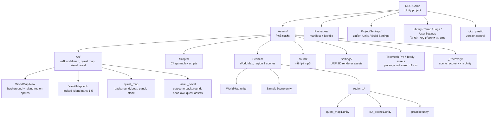
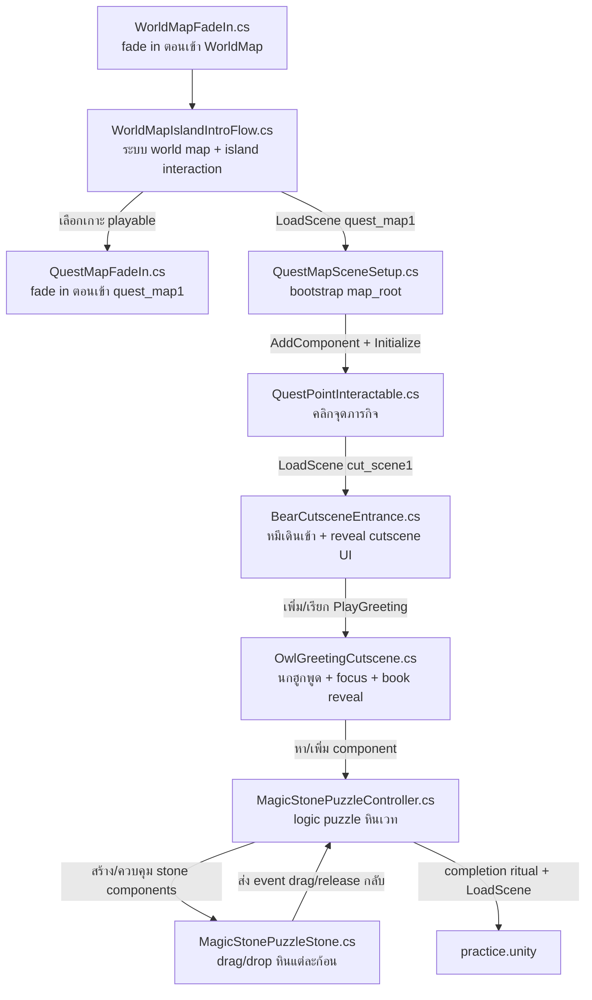
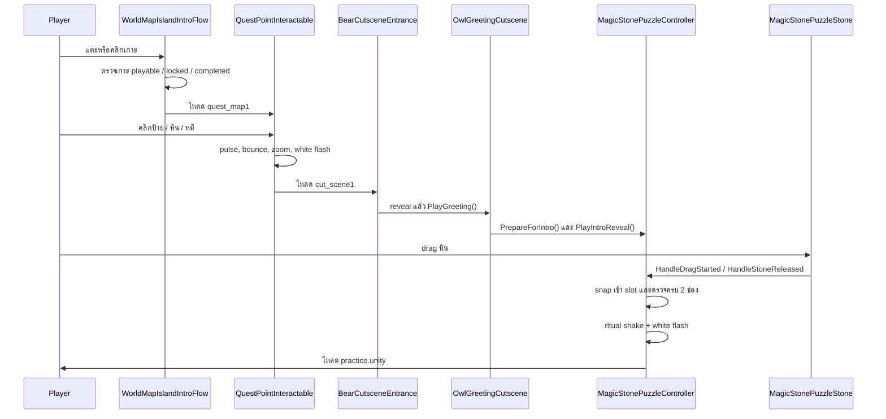

# แผนภาพโครงสร้างโปรเจกต์ NSC-Game

เอกสารนี้สรุปจากโครงสร้างไฟล์ใน repo และสคริปต์หลักใน `Assets/Scripts/` โปรเจกต์นี้เป็น Unity project เวอร์ชัน `6000.4.3f1` ใช้ URP 2D, Unity Input System, UGUI และ TextMesh Pro

## ภาพรวมโครงสร้างโปรเจกต์

## Flow ของ Scene หลัก

```mermaid
flowchart LR
    start["WorldMap.unity<br/>ผู้เล่นเลือกเกาะ"]
    quest["quest_map1.unity<br/>จุดภารกิจ: ป้าย + หินเวท + หมี"]
    cut["cut_scene1.unity<br/>หมีเข้าฉาก, นกฮูกพูด, เปิด puzzle"]
    practice["practice.unity<br/>ฉากถัดไปหลัง puzzle"]

    start -->|"WorldMapIslandIntroFlow<br/>LoadScene: quest_map1"| quest
    quest -->|"QuestPointInteractable<br/>LoadScene: cut_scene1"| cut
    cut -->|"MagicStonePuzzleController<br/>LoadScene: Assets/Scenes/region 1/practice.unity"| practice

    build["EditorBuildSettings.asset<br/>ยังอ้าง minigame1-1, minigame1-2, minigame1-3"]
    missing["หมายเหตุ: ตอนสำรวจไฟล์ ไม่พบไฟล์ scene เหล่านี้ใน Assets/Scenes"]
    build -.-> missing
    missing -.-> start
```

## ความสัมพันธ์ของไฟล์ Scripts

## อธิบายไฟล์ใน `Assets/Scripts/`

| ไฟล์ | หน้าที่หลัก |
|---|---|
| `WorldMapIslandIntroFlow.cs` | controller ใหญ่ของหน้า World Map: อ่านเกาะทั้งหมดที่ชื่อขึ้นต้น `Island`, จัดการ click/touch/drag/zoom/pinch, เลือกเกาะที่เล่นได้, ทำ fade ก่อนเปลี่ยน scene, จัด progression ด้วย `PlayerPrefs`, ทำ locked island overlay, path cue, focus mist, glow, bounce และ guide UI พร้อมเสียง/Android TTS |
| `WorldMapFadeIn.cs` | bootstrap หลังโหลด scene แล้วถ้า active scene คือ `WorldMap` จะสร้าง canvas สีดำเต็มจอและค่อย ๆ fade out เพื่อเปิดฉาก |
| `QuestMapSceneSetup.cs` | bootstrap สำหรับ `quest_map1`: หา `map_root`, หา child `panel ?`, `stone`, `bear_0`, แล้วเพิ่ม `QuestPointInteractable` ให้อัตโนมัติถ้ายังไม่มี |
| `QuestMapFadeIn.cs` | fade in สีดำสำหรับ `quest_map1` โดยสร้าง canvas runtime แล้วทำ alpha จาก 1 เป็น 0 |
| `QuestPointInteractable.cs` | logic จุดภารกิจในแผนที่ย่อย: ทำป้าย/หิน pulse พร้อม glow, ตรวจ mouse/touch บนป้าย หิน หรือหมี, bounce หมี, zoom camera ไปจุดภารกิจ, white flash แล้วโหลด `cut_scene1` |
| `BearCutsceneEntrance.cs` | cutscene ตอนเข้าฉาก: white fade out ตอนเริ่ม, ขยับหมีจาก waypoint sprites หรือ path ตรง, squash/stretch ตอนลงพื้น, เปิด shield ถ้ามี, fade in object ถัดไป แล้วเรียก `OwlGreetingCutscene.PlayGreeting()` |
| `OwlGreetingCutscene.cs` | ลำดับ visual novel: cache frame นกฮูก, สลับ frame ตามเวลา, zoom/dim background, เล่นเสียง, focus หมี, reveal หนังสือ, เตรียมและเปิด `MagicStonePuzzleController` |
| `MagicStonePuzzleController.cs` | controller ของ puzzle หินเวท: หา stone/slot, reveal stone ทีละก้อน, เปิดให้ drag, snap stone เข้า slot, แทนที่ stone เดิมถ้าช่องถูกใช้, เมื่อครบสองช่องจะเล่นพิธีกรรมสั่น/flash แล้วโหลด scene ถัดไป |
| `MagicStonePuzzleStone.cs` | component ของหินแต่ละก้อน: implements `IBeginDragHandler`, `IDragHandler`, `IEndDragHandler`, จำตำแหน่งบ้านและ slot ปัจจุบัน, reveal/move/return animation, ส่ง event drag/release ให้ controller ตัดสินใจ |

## ลำดับ Gameplay จากโค้ด

## หมายเหตุสำคัญ

- `Assets/Scripts/` คือสคริปต์ gameplay ของโปรเจกต์นี้ ส่วน `TextMesh Pro/Examples & Extras/Scripts` เป็นตัวอย่างจาก package ไม่ใช่ระบบเกมหลัก
- `Library/`, `Temp/`, `Logs/`, `UserSettings/` เป็นโฟลเดอร์ที่ Unity สร้างระหว่างใช้งาน โดยทั่วไปไม่ใช่ source หลักของเกม
- `ProjectSettings/EditorBuildSettings.asset` มี scene `minigame1-1`, `minigame1-2`, `minigame1-3` อยู่ใน Build Settings แต่ตอนสำรวจไฟล์ไม่พบไฟล์ `.unity` เหล่านี้ใน `Assets/Scenes/`
- ชื่อโฟลเดอร์ `visaul_novel` น่าจะตั้งใจหมายถึง `visual_novel` แต่โค้ดและ asset ปัจจุบันอ้างตามชื่อที่มีอยู่จริง
