# WordFlow — Region 1: หมู่บ้านฟาง (Straw Village)

The first region's concrete design: map, scenery, the curriculum (magic-stone
progression + content engine), the **25-quest / 5-day** schedule, and the boss. Sits on
top of the reusable systems in [[wordflow-game-design]]; story premise is in
[[wordflow-story]].

**The five regions** (theme arc): 1 หมู่บ้านฟาง Straw Village → 2 ป่าทึบแสง Lightless
Forest → 3 หุบเขาน้ำแข็ง Ice Valley → 4 นครทองคำ Golden City → 5 ปราสาทเงิน Silver
Castle. Region 1's dark far edge **borders Region 2's forest** (continuity).

## Letters & words (locked)

- **Magic stones = the 7 graphemes:** consonants **ก ป ต ย ข**, vowels **า ี**.
- **7 craftable words:** กา (crow), ปา (throw), ตา (eye), ยา (medicine), ขา (leg),
  ตี (hit), ปี (year).
- Pedagogy notes: vowel **า** (open /aː/) is known from the start; **ี** is introduced
  later and on an already-known consonant (ต→ตี); the **ก /k/ vs ข /kʰ/** aspiration
  look/sound-alike pair is kept apart (ก from the start, ข earned last).

## Pacing — days, not zones (the clinic "too fast" fix)

Region 1 is paced by **in-game days**, deliberately slow so progression can't outrun
mastery (the clinics' one must-fix). **Two rules drive everything:**

1. **5 encounters = nightfall = the day ends.** A daytime session is hard-capped to 5
   graded quests (~15–30 min attention span; see [[wordflow-game-design]]).
2. **At most ONE new magic stone per night.** The child **starts with 3 stones** and
   earns **one more each night**, so reaching all 7 takes **4 nights minimum**. After the
   7th stone there is **one more full day of review** ("earn the right to fight") before
   the boss.

This yields a fixed **6-day region**: **5 encounter-days (25 graded quests) → boss day.**
The trail **moves forward** a little each day and **auto-saves at nightfall** (resume next
day where you left off — no waypoints, the player can't move). The world recolors one step
further every night.

| Day | Stones owned at start | New word(s) introduced | Earned at nightfall |
|---|---|---|---|
| **1** | ก · ย · า (3) | **กา** crow, **ยา** medicine (foundation) | **+ต** |
| **2** | +ต (4) | **ตา** eye | **+ป** |
| **3** | +ป (5) | **ปา** throw *(plants the bear ally)* | **+ี** |
| **4** | +ี (6) | **ตี** hit, **ปี** year *(abstract)* | **+ข → 7/7** |
| **5** | ข / 7-of-7 (7) | **ขา** leg + **review of all 7** | — (boss unlocks) |
| **6** | 7/7 | — **BOSS** — | — |

**Progress % = stones ÷ 7.** It drives the always-on progression bar **and** the hub
recolor (see Scenery). Day 5 earns no stone — it is a pure mastery/approach gate.

## Content engine — 25 quests from 7 words (2026-06-14 revision)

"Same word, new situation, less help" — three multipliers (full rationale in
[[wordflow-game-design]]):

1. **Multiple contexts per word** (breadth) — each word powers 2–4 different village
   scenes (data rows + light art variants).
2. **Fading scaffold across repeats** (depth = where mastery is built) — two modes, not
   three:
   - **Supported** (first meet + early repeats): "hear it" button available, owl says the
     full word on first reveal, each tile speaks its phoneme when placed.
   - **Recall** (later repeats — the real challenge): all pre-build hints off — no
     "hear it", no proactive audio. Build + say from memory →
     **clearing Recall is what locks a word in.**
   - In both modes, tiles **always start in the tray** (never pre-placed in slots), in a
     **fixed, never-shuffled** order — shuffling/distractor tiles are a **boss-only**
     lever (see boss Phase 3).
   - **Post-build echo, always on:** once the child finishes building any word, the owl
     voices the blend of *what they built*, once, before the mic opens for recitation —
     this applies in every mode, including Recall + Echo.
3. **Echo format** (variety / ear training) — no picture; the prompt is sound-only.
   Orthogonal to Supported/Recall — can pair with either.

The 5-day schedule below instantiates exactly **25 quests** this way. A new word always
appears the day **after** its stone is earned; earlier words **recur in Recall mode**
(less help) as the days go on — that recurrence *is* the repetitive practice.

## Map — one forward trail; zones are scenery only

Zero movement control is locked → **one linear trail**, the character **auto-moves**
forward a little each day and **auto-saves at nightfall**. The three named areas
(Homesteads → Hayfields → Withered Furrows) are **scenery the trail passes through, not
stone gates** — stones are gated by *day*, not by *place*. Scenery darkens toward the boss
while cleared ground recolors warm.

### Visual map

The illustrated world map (renders in Obsidian; open the SVG in a browser to zoom or
export a PNG for slides):

![[wordflow-region-1-map.svg]]

The same map as a flow diagram (renders inline on GitHub / anywhere Mermaid is supported):

```mermaid
flowchart LR
  HUB([HUB · หมู่บ้านฟาง<br/>village entrance]):::hub --> D1
  subgraph D1["DAY 1 · owns ก·ย·า · scenery: Homesteads"]
    direction LR
    A1([1 ยา sick villager]) --> A2([2 กา silent crow]) --> A3([3 ยา feverish lamb]) --> A4([4 กา crow at well]) --> A5([5 Echo review])
  end
  A5 -->|🌙 +ต| D2
  subgraph D2["DAY 2 · +ต ตา · scenery: village edge → fields"]
    direction LR
    B1([6 ตา blind scarecrow]) --> B2([7 ยา wilted herb ↑]) --> B3([8 ตา blank idol]) --> B4([9 กา crow answers ↑]) --> B5([10 ตา Echo])
  end
  B5 -->|🌙 +ป| D3
  subgraph D3["DAY 3 · +ป ปา · scenery: open hayfields"]
    direction LR
    C1([11 ปา BEAR ★]) --> C2([12 ตา deep field ↑]) --> C3([13 ปา scatter crows]) --> C4([14 ยา sick dog ↑]) --> C5([15 ปา Echo])
  end
  C5 -->|🌙 +ี| D4
  subgraph D4["DAY 4 · +ี ตี ปี · scenery: bell → frost"]
    direction LR
    E1([16 ตี frozen bell]) --> E2([17 ปี withered crop *]) --> E3([18 ตี silent anvil]) --> E4([19 ปี tree-rings Echo]) --> E5([20 review Echo])
  end
  E5 -->|🌙 +ข → 7/7| D5
  subgraph D5["DAY 5 · 7/7 · ขา + review all · scenery: Withered Furrows"]
    direction LR
    F1([21 ขา lamed animal]) --> F2([22 ยา relapse ↑]) --> F3([23 ตา sentinel ↑]) --> F4([24 ปา/ปี ↑]) --> F5([25 กา+ขา Echo])
  end
  F5 -->|🌙 village whole| BOSS{{DAY 6 · BOSS · corrupted great scarecrow<br/>picture→word · 3–4 ♥}}
  C1 -. bear returns .-> BOSS
  BOSS --> R2[[→ Region 2 · ป่าทึบแสง]]
  classDef hub fill:#3c5a2e,stroke:#eadfae,color:#fff;
  classDef boss fill:#2b1414,stroke:#d23b3b,color:#fff;
  class BOSS boss;
```



`↑` = a word recurring at a higher (harder) scaffold tier. `★` = planted ally. `*` ปี is
the one abstract word.

### ASCII reference

```
[HUB] หมู่บ้านฟาง entrance — fog & colour clear one step per night (0→7 stones = 0→100%)
   | auto-run (top-down), forward a little each day, auto-save at nightfall
   v
DAY 1  Homesteads scenery — gentlest, lightly greyed   ·  owns ก ย า
   1 ยา sick villager · 2 กา silent crow · 3 ยา feverish lamb · 4 กา crow at well · 5 Echo
   v  🌙 nightfall → earn +ต
DAY 2  village edge → fields — mist thickening          ·  +ต → ตา
   6 ตา blind scarecrow · 7 ยา wilted herb↑ · 8 ตา idol · 9 กา crow answers↑ · 10 ตา Echo
   v  🌙 → earn +ป
DAY 3  open hayfields, barn, hay bales — first menace    ·  +ป → ปา
   11 ปา BEAR★ · 12 ตา deep field↑ · 13 ปา pest crows · 14 ยา sick dog↑ · 15 ปา Echo
   v  🌙 → earn +ี
DAY 4  bell tower → frost, furrows begin — cold          ·  +ี → ตี, ปี
   16 ตี frozen bell · 17 ปี withered crop* · 18 ตี anvil · 19 ปี tree-rings Echo · 20 review
   v  🌙 → earn +ข → 7/7
DAY 5  Withered Furrows — most colour-faded, boss looming ·  7/7 → ขา + review all
   21 ขา lamed animal · 22 ยา relapse↑ · 23 ตา sentinel↑ · 24 ปา/ปี↑ · 25 กา+ขา Echo
   v  🌙 "the village is whole — fight tomorrow"
[DAY 6 · BOSS LAIR] old granary / the great corrupted scarecrow → picture→word (hearts)
   → bear bursts in (surprise) → win → whole village recolors → Region 2 unlocks
```

## The 25 quests (the day-by-day schedule)

The detailed schedule. **Tier** = audio-hint mode (2026-06-14 revision): **Supported**
(pre-build hints on — "hear it", owl says the word on first reveal, per-tile phonics) or
**Recall** (pre-build hints off — the real challenge); **+ Echo** = sound-only prompt,
pairable with either. Tiles always start in the tray in a fixed, never-shuffled order
(shuffling/distractors are boss-only); a post-build echo of what the child built always
plays before recitation, in every cell below. "Scene" is the Silence state; "Reaction" is
what the healed creature/object does; "Scenery / atmosphere" sets the camera mood; "FX" is
the success burst.

### Day 1 — owns ก · ย · า · teaches กา, ยา · scenery: **Homesteads** (gentlest, a held-breath hush)

| # | Word /IPA | Tier | Map location | Scene (The Silence) | Reaction | Scenery / atmosphere | Magic FX |
|---|---|---|---|---|---|---|---|
| 1 | ยา /jaː/ medicine | Supported (first meet) | first hut past the entrance arch | villager slumped grey against a straw house, breath shallow, the well still behind him | rises, *wais* in thanks, points down the path, **warns of the dark ahead**, waves you on | thin drifting motes, muffled wind, desaturated but not menacing — the "something's wrong here" opener | warm green bloom + soft chime, roof regains straw-gold |
| 2 | กา /kaː/ crow | Supported (first meet) | scarecrow in the first garden plot | a crow perched stiff, beak open, no caw | feathers burst to colour, a visible "caw" ripple, it flies up | still, colourless dawn, a held breath | feather-burst + expanding sound-ring |
| 3 | ยา /jaː/ medicine | Supported (review) | animal pen beside the well | a feverish lamb in grey straw, flank heaving | cools, colour floods, stands and nuzzles | soft pity; faint warmth returns around cleared spots | green sparkle over the lamb |
| 4 | กา /kaː/ crow | Supported (review) | the village well | a crow frozen mid-hop on the well rim, silent | unfreezes, caws, flaps to a rooftop | quiet, slightly warmer as Day-1 spots clear | sound-ripple + colour on the well stones |
| 5 | ยา / กา — **Echo** | Recall + Echo | the village gate | owl plays a word's *sound only*; build it from sound | the gate-lantern lights | dusk falling, first nightfall near | lantern-glow → 🌙 **nightfall → +ต** (auto-save, recolor step 1) |

### Day 2 — +ต · teaches ตา · scenery: **village edge → hayfields begin** (mist thickening)

| # | Word /IPA | Tier | Map location | Scene (The Silence) | Reaction | Scenery / atmosphere | Magic FX |
|---|---|---|---|---|---|---|---|
| 6 | ตา /taː/ eye | Supported (first meet) | first field-scarecrow at the hayfield edge | scarecrow with blank/clouded eyes; gloom blocks the way forward | eyes light, it straightens and "watches"; the gloom clears | overcast; the path ahead visibly opens once cleared | eyes spark to colour, fog parts |
| 7 | ยา /jaː/ medicine | Recall (review) | windowsill of the last village house | a wilted potted herb, leaves grey and drooping | greens, perks up, a tiny flower opens | bittersweet — a last touch of the village before the fields | green bloom, petals colour |
| 8 | ตา /taː/ eye | Supported (review) | a roadside stone idol | an old idol with blank carved eyes, moss-grey | its eyes glow, it seems to "see" the traveler | faintly sacred, hushed | eye-glow + colour down the stone |
| 9 | กา /kaː/ crow | Recall (review) | a second scarecrow in the field | a lone crow that won't answer the first one's call | it caws back; the two circle up together | a small joy returning to the fields | paired sound-rings |
| 10 | ตา — **Echo** | Recall + Echo | a villager at the field's edge | sound-only prompt; build ตา from the sound | the villager blinks, sees, thanks you | dusk, mist glowing | light in the eyes → 🌙 **nightfall → +ป** (recolor step 2) |

### Day 3 — +ป · teaches ปา ★ · scenery: **open hayfields, barn, hay bales** (densest mist, first real menace)

| # | Word /IPA | Tier | Map location | Scene (The Silence) | Reaction | Scenery / atmosphere | Magic FX |
|---|---|---|---|---|---|---|---|
| 11 | ปา /paː/ throw | Supported (first meet) **★ ally** | open hayfield by the barn | a grey **bear** crashes through, scattering straw, looming over a cowering scarecrow | hurl a light-bolt; the bear startles, rears, **bolts into the treeline** (flees, doesn't die) | tense, kinetic, a low growl under the silence | streaking bolt + impact burst; straw flutters back gold |
| 12 | ตา /taː/ eye | Recall | a scarecrow deep in the field | another blind scarecrow watching nothing | eyes light, it turns to face the path | open, windswept, grey | eye-glow |
| 13 | ปา /paː/ throw | Supported (review) | the crop rows | a flock of pest crows frozen over the grain, menacing | a thrown bolt scatters them off the field | edgy, fluttering | bolt + scatter of colour |
| 14 | ยา /jaː/ medicine | Recall | the barn door | a sick farm dog guarding the barn, grey and weak | heals, stands, wags, barks once (sound returns) | a guardian restored; warmth at the barn | green bloom + a bark-ring |
| 15 | ปา — **Echo** | Recall + Echo | an old fruit tree at the field's far end | sound-only; build ปา to knock a frozen fruit down | fruit drops, colour spreads up the tree | dusk, the fields going dark | bolt + fruit-fall → 🌙 **nightfall → +ี** (recolor step 3) |

### Day 4 — +ี · teaches ตี, ปี · scenery: **bell tower → frost, furrows begin** (cold, oppressive; Region-2 forest on the horizon)

| # | Word /IPA | Tier | Map location | Scene (The Silence) | Reaction | Scenery / atmosphere | Magic FX |
|---|---|---|---|---|---|---|---|
| 16 | ตี /tiː/ hit | Supported (first meet) | the village bell tower | the bell frozen silent under grey frost | struck → it rings; the toll pushes the silence back in a visible wave | cold, still, then a clear ringing release | bell-strike shockwave of colour |
| 17 | ปี /piː/ year | Supported (first meet, abstract — most scaffold) | a dead furrow in the withering field | a withered crop sprout in dead soil | a year passes (seasons cycle), it grows golden and tall | melancholy turning hopeful; time-lapse light | season-cycle bloom, tree-ring ripple |
| 18 | ตี /tiː/ hit | Supported (review) | the blacksmith's lean-to | a silent anvil, hammer frozen mid-air | the hammer falls, the anvil rings, sparks fly | industrious warmth amid the cold | spark-burst + sound-ring |
| 19 | ปี — **Echo** | Supported + Echo | an old tree with frozen rings | sound-only; build ปี to turn the tree-rings | rings spin through seasons, the tree leafs out | quiet wonder, cold light | ring-spin + green flush |
| 20 | review — **Echo** | Recall + Echo (mixed review) | the last warm spot before the furrows | sound-only review of a Day 1–3 word | the chosen scene flickers back to colour | dusk, the dark furrows ahead | per-word FX → 🌙 **nightfall → +ข → 7/7** (recolor step 4) |

### Day 5 — 7/7 (no new stone) · teaches ขา + reviews all · "earn the right to fight" · scenery: **Withered Furrows** (most colour-faded — bright but quietest/stillest — boss granary looming)

| # | Word /IPA | Tier | Map location | Scene (The Silence) | Reaction | Scenery / atmosphere | Magic FX |
|---|---|---|---|---|---|---|---|
| 21 | ขา /kʰaː/ leg | Supported (first meet — last word, uses ข) | the dying furrows | a lamed farm animal collapsed, leg greyed, can't flee the dark | leg restored, colour floods, it rises and trots toward the healed village | pitying, cold — the last creature to save | leg-mend glow, colour rushes out |
| 22 | ยา /jaː/ medicine | Recall (review) | a traveler fallen on the dark road | a relapsed sick villager who wandered toward the furrows | healed, helped back toward the village light | oppressive dark, a small mercy | green bloom against the gloom |
| 23 | ตา /taː/ eye | Recall | a watchtower scarecrow facing the boss lair | a blind sentinel that should be watching the granary | eyes light, it "guards" the approach | tense; the boss-smoke visible ahead | eye-glow piercing the smoke |
| 24 | ปา / ปี | Recall (review) | the furrow's edge at the forest border | pest crows / a last withered tree by the dark wood | scattered / regrown; the border steadies | dread; the forest of Region 2 looming | bolt / season-bloom |
| 25 | กา + ขา — **Echo** | Recall + Echo (finale review) | the granary gate | sound-only review; the village is whole behind you | the path to the boss opens; the owl steels itself | the threshold — silence heaviest here | gate-light → 🌙 **"the village is whole; fight tomorrow" → BOSS unlocks** |

### Word reference (phonics & boss-pictures)

| Word | Phonics (owl) | First taught | Boss meaning-picture |
|---|---|---|---|
| **ยา** /jaː/ medicine | ยอ+อา→ยา | Day 1 | potion bottle |
| **กา** /kaː/ crow | กอ+อา→กา | Day 1 | crow silhouette |
| **ตา** /taː/ eye | ตอ+อา→ตา | Day 2 | an eye |
| **ปา** /paː/ throw | ปอ+อา→ปา | Day 3 | hand throwing + motion lines |
| **ตี** /tiː/ hit | ตอ+อี→ตี | Day 4 | hammer striking a bell |
| **ปี** /piː/ year * | ปอ+อี→ปี | Day 4 | sprout→tree + season cycle |
| **ขา** /kʰaː/ leg | ขอ+อา→ขา | Day 5 | a leg |

**ปี ("year")** is the only abstract word → depict via a season/tree-ring cycle and give
it the most hint scaffold in the boss.

## Scenery — three states

> **Read with the art-direction correction (2026-06-13) in [[wordflow-game-design]]:**
> "desaturated," "dimmed," and "darkest" below mean *colour turned down under bright, soft
> daylight* — never literal darkness. Keep every state **light and airy**; the Silence
> drains saturation, not brightness.

- **Walking (top-down travel):** pastoral straw-village — dirt paths, straw roofs,
  hayfields, fences, scarecrows — under the Silence: **soft, faded pastels under bright
  overcast** (washed-out, not grey-dark), drifting motes, muffled ambience, parallax.
  Cleared areas + hub re-saturate to warm, vivid colour one step per night.
- **Casting magic (encounter focus cam):** the *quietest* screen — the troubled
  creature/object small up top, the magic book/stone panel large below, owl at side,
  background **frozen & gently muted (still bright)**; on resolve, a burst of colored
  magic FX floods the scene back to full colour.
- **Boss (lair):** the most *dramatic* space, **not the darkest** — village heart under a
  thick hush of pale, smoky mist (soft greys, not black); a big **grumpy/gloomy** scarecrow
  looms upper-frame with heart HP; correct casts blast colour in; the bear's surprise
  charge; on win colour floods out and the whole village re-saturates. Reads as a gentle,
  exciting climax — never frightening.

**Two recolor systems:** progress % (stones ÷ 7) re-saturates the **hub**; the **path**
independently **lowers saturation** Day 1 → Day 5 (rising hush/quiet — *not* growing
darkness). Spatial tension comes from stillness and faded colour, never from going dark.

## Boss — the cursed straw man (the Hush's vessel)

**Day 6**, after the Day-5 review unlocks the fight. He is the **great scarecrow at the
village heart** — but the premise is that **he is not the enemy; the Silence is _wearing_
him.** You don't kill him, you **break the curse off him.** He grows more desperate as you
win, then is freed at the end.

**Structure — 4 hearts = 4 phases, one distinct puzzle _type_ each.** The arc escalates by
**removing one support each phase** (meaning+picture → sound only → discrimination trap →
reorder/blend), never by raising raw difficulty — so it stays winnable for a young LD
child. He is wrapped in pale silence-smoke (a shield): **you cannot damage him until you
solve that heart's puzzle** — solving it blasts the smoke off one weak point and the heart
breaks.

**Two rules that protect the clinical core — non-negotiable:**
- **Story never enters the decode.** All phase drama plays in the *visual/behavioural
  channel* (boss animation, owl reactions, FX, recolor) and in the *transition beats
  between casts* — never as text, never during the build-the-word moment. The focus cam
  still goes quietest at the decode: boss small up top, background frozen, stone panel
  dominant.
- **No phase is gated on remembering the story.** Each phase is self-contained — solving
  Heart 4 never requires recalling Heart 1. The narrative is *felt*, not held in working
  memory.

**Safe-failure (every phase):** a wrong answer **never costs a heart, never
counterattacks, never penalises** — a non-word fizzles to a dull grey puff + dud SFX + owl
"try again"; a real-but-wrong word plays its own FX but deals no damage + owl "try again."
The child can never lose.

**Hint ladder (every phase):** (1) request a hint → owl says the word phonically (e.g.
ตอ+อา→ตา) and the correct stone **brightens slightly**; (2) no input for 10s → a correct
stone **auto-brightens**. ปี (Phase 4) carries the most scaffold. Read the boss art through
the [[wordflow-game-design]] art-direction correction: bright & faded, *dramatic not
scary* — a big grumpy/sagging straw man, never a horror monster.

### Phase 1 / Heart 1 — "He Won't Look at You" · Picture → Word
- **Boss:** slumped on his pole, head down, refusing to acknowledge you — the Silence makes
  him ignore you.
- **Puzzle:** owl nudges *make him see*; a clouded-**eye** meaning-picture → build **ตา**
  (ตอ+อา), say it. The familiar mechanic from every encounter = the confidence opener.
- **Hit:** his painted eyes snap open, smoke peels off, he jerks upright on his pole — now
  he's watching you. −1 heart.
- **Transition:** a dry, rattling straw-creak; the hush thickens.

### Phase 2 / Heart 2 — "He Smothers the Sound" · Sound → Word (Echo, ears only)
- **Boss:** awake and fighting back, he does the one thing the Silence knows — he
  **smothers everything**; the next weak point's picture is swallowed in pale smoke, so you
  *can't see it.*
- **Puzzle:** only a muffled cry comes through (owl relays the **sound only**, no image) →
  build **ยา** (ยอ+อา). Thematic: he is sick with the curse and you push soothing magic
  through the smother.
- **Hit:** the smoke thins, sound rushes back with a chime, he flinches. −1 heart.
- **Transition:** desperate, he starts to cheat.

### Phase 3 / Heart 3 — "He Tries to Trick You" · Minimal-pair discrimination
- **Boss:** cornered, he fights dirty — flails a straw **leg** to knock you back while the
  Silence **whispers a false word**, scattering look-alike stones (**ก** beside **ข**) and
  flashing a misleading hint to make you miscast.
- **Puzzle:** aim true — strike his leg → build **ขา** (ขอ+อา), choosing **ข** /kʰ/ and
  resisting the ก/กา "crow" lure. *The aspiration-pair trap IS his deception* — the
  curriculum's signature ก/ข drill, dressed as the boss's trick.
- **Hit:** his straw leg topples, he lurches and sags. −1 heart.
- **Transition:** down to his last heart, the Silence tears time open.

### Phase 4 / Heart 4 — "The Endless Year" · Scramble + recall (finale)
- **Boss:** the curse shows its true goal — trap the village in an **endless withered
  year**: no seasons, eternal silence. He **tangles the word** — the stones for ปี spill
  out jumbled.
- **Puzzle:** set time right — reorder **ป + ี → ปี** (/piː/), with full scaffold so it
  always lands. The one abstract word, saved for the climax.
- **Finale:** as you build it the **bear bursts in** and pins him (the payoff for the
  Day-3 quest); you cast the word, **the years turn** — seasons cycle, green floods out,
  and the curse **shatters off** the straw man (he slumps, freed and harmless).
- **Win (0 hearts):** the whole village **re-saturates** to full colour, the Silence
  lifts, and **Region 2 (ป่าทึบแสง) unlocks.**

### Demo scope (≈10-day deadline)
Write all four phases as the **production target**, but the demo does **not** need them all
animated. One teammate hand-makes every asset (see [[wordflow-game-design]]), and four
*distinct* boss behaviours (slump → smother → flail → tangle-time) is the real cost — not
the kids' attention span. For the contest demo, **Heart 1 + the Heart 4 finale alone read
as a complete epic**; phases 2–3 are post-demo polish.

## Amendments (2026-07-08) — challenge system & quest payoffs

From the judge/advisor "too easy / too dull" feedback. Full design in
[[wordflow-game-design]] (Challenge & pressure system) and [[wordflow-story]]; Region-1
specifics:

- **Pressure tuning:** Region 1 runs the **kindest rung** of the difficulty ladder — Flow
  + smoke as ambient visual/gift-clock only (no tile muffling, no swallowed stones, no
  shuffle). The ก distractor with meaning-reveal is Region 1's single curated distractor.
- **Reading-order slot lock** applies to all 25 quests (tiles place left→right, placed
  tiles lock; pull-back costs smoke progress).
- **Gifts:** each of the 25 quests can award its creature's memento when cleared before
  the smoke closes in (feather, bell charm, flower…). Missed gifts are re-earnable via
  **night redo**. Full Region-1 set → the secret **festival ending** after the boss.
- **Friends — pick-a-buddy:** the trail is forward-only, so friends come to the hero. At
  the **morning send-off** the child picks **one buddy for the day** (follows the trail,
  reacts to encounters, grants its skill — icon+number card, e.g. 🕐+5 slower smoke; one
  skill built for real, the rest window-dressed); the scene shows only the **buddy circle
  of ~6** (full roster in the collection book), so it never bloats. Friends travel to
  later regions; the **bear joins the roster after the boss**. All friends join the
  boss-scene crowd.
- **Quest payoffs (anti-filler):** the **bell (quest 16)** becomes a gate — its toll is
  what calls the boss out at the village heart. The boss scene stages the **climax
  callbacks**: bear charge (existing), crows mobbing the scarecrow, healed villagers
  gathered, the regrown hayfield as battlefield, the healed animal carrying the hero the
  last stretch. See [[wordflow-story]] "Region 1 — every quest pays off."

## Related

- [[wordflow-game-design]] — the reusable systems (camera, loop, content engine, boss)
- [[wordflow-story]] — "The Silence" premise + Straw Village arc
- [[wordflow]] · [[wordflow-tech-stack]] · [[active-learning]] · [[grapheme-to-phoneme-g2p]] · [[dyslexia]]
